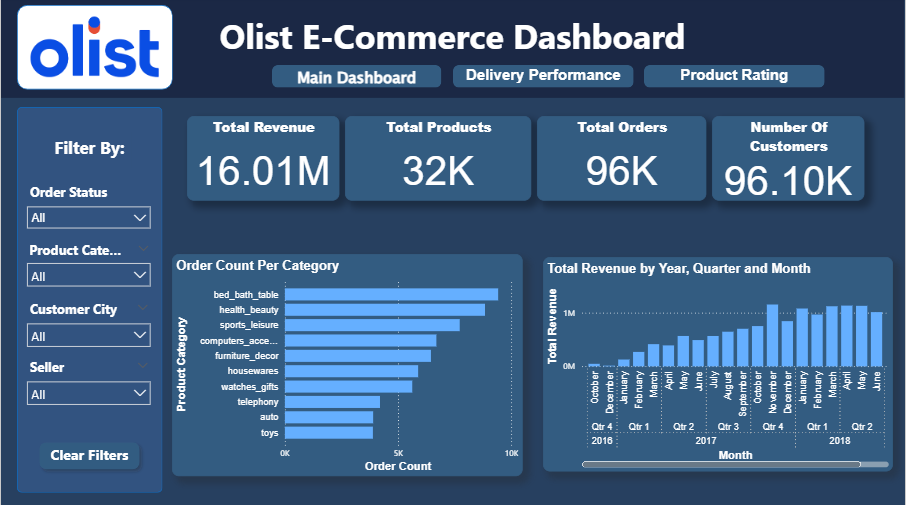
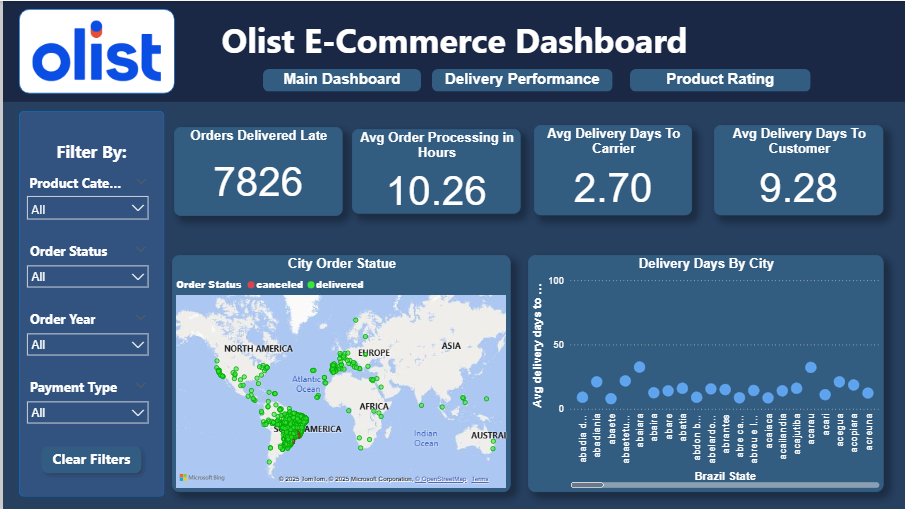
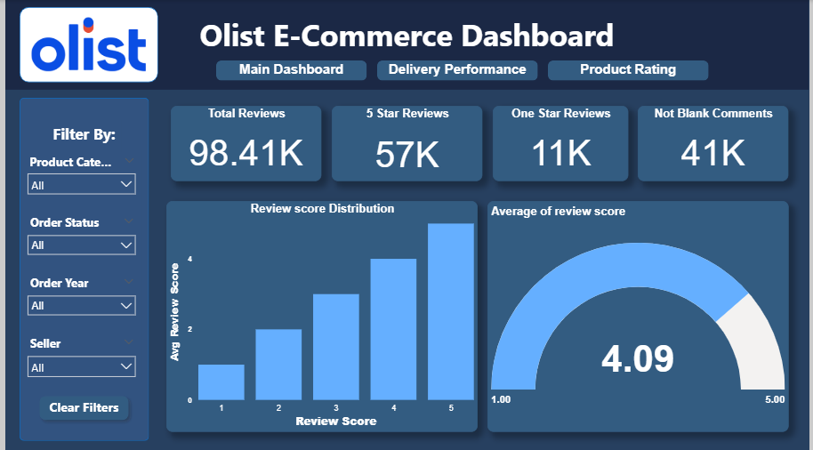

# 📊 Olist E-Commerce Power BI Dashboard

A 3-page interactive Power BI dashboard analyzing the Olist Brazilian E-Commerce dataset.  
The report covers delivery performance, sales insights, customer behavior, and product reviews.

---

## 📷 Dashboard Preview

### **Main Dashboard**

---

### **Delivery Performance Dashboard**

---

### **Product Rating Dashboard**

---

## 📁 Dashboard Pages

---

### **1️⃣ Main Dashboard**
Provides a complete commercial overview.

#### 🔍 KPIs
- **Total Revenue:** 16.01M  
- **Total Products:** 32K  
- **Total Orders:** 96K  
- **Number of Customers:** 96.10K  

#### 📊 Visuals
- Order Count per Category  
- Revenue by Year, Quarter & Month  

---

### **2️⃣ Delivery Performance Dashboard**
Focuses on logistics and delivery timelines.

#### 🔍 KPIs
- **Orders Delivered Late:** 7,826  
- **Avg Order Processing Time:** 10.26 hours  
- **Avg Delivery Days to Carrier:** 2.70 days  
- **Avg Delivery Days to Customer:** 9.28 days  

#### 📊 Visuals
- City Order Status Map  
- Delivery Days by City  

---

### **3️⃣ Product Rating Dashboard**
Explores customer satisfaction and review behavior.

#### 🔍 KPIs
- **Total Reviews:** 98.41K  
- **5-Star Reviews:** 57K  
- **1-Star Reviews:** 11K  
- **Non-Blank Comments:** 41K  

#### 📊 Visuals
- Review Score Distribution  
- Average Review Score Gauge (4.09)  

---

## 🎛️ Filters (All Pages)

- Product Category  
- Order Status  
- Order Year  
- Customer City  
- Seller  
- Payment Type  
- **Clear Filters** button  

---

## 🛠️ Tools & Technologies

- **Power BI Desktop**  
- **DAX Measures**  
- **Power Query**  
- **Data Modeling (Star Schema)**  
- **Custom UI Theme**  

